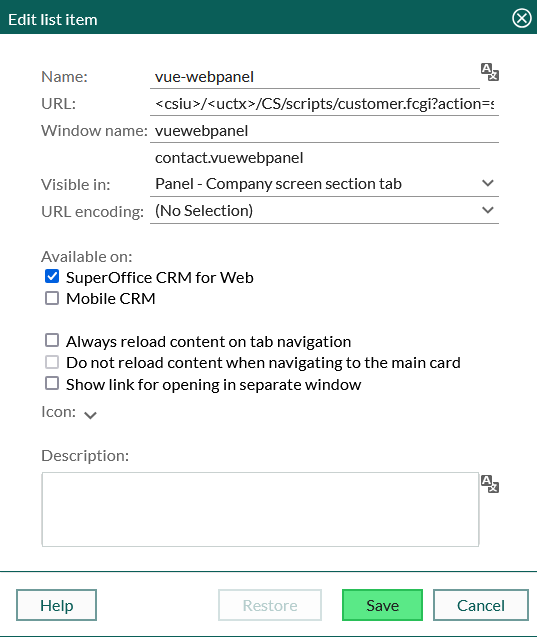

# vue-webpanel

This template should help get you started developing with Vue 3 in Vite, hosted as a webpanel inside of SuperOffice.

## Recommended IDE Setup

[VS Code](https://code.visualstudio.com/) + [Vue (Official)](https://marketplace.visualstudio.com/items?itemName=Vue.volar) (and disable Vetur).

## Recommended Browser Setup

- Chromium-based browsers (Chrome, Edge, Brave, etc.):
  - [Vue.js devtools](https://chromewebstore.google.com/detail/vuejs-devtools/nhdogjmejiglipccpnnnanhbledajbpd)
  - [Turn on Custom Object Formatter in Chrome DevTools](http://bit.ly/object-formatters)
- Firefox:
  - [Vue.js devtools](https://addons.mozilla.org/en-US/firefox/addon/vue-js-devtools/)
  - [Turn on Custom Object Formatter in Firefox DevTools](https://fxdx.dev/firefox-devtools-custom-object-formatters/)

## Type Support for `.vue` Imports in TS

TypeScript cannot handle type information for `.vue` imports by default, so we replace the `tsc` CLI with `vue-tsc` for type checking. In editors, we need [Volar](https://marketplace.visualstudio.com/items?itemName=Vue.volar) to make the TypeScript language service aware of `.vue` types.

## Customize configuration

See [Vite Configuration Reference](https://vite.dev/config/).

## Project Setup

```sh
npm install
```

### Compile and Hot-Reload for Development

```sh
npm run dev
```

### Type-Check, Compile and Minify for Production

```sh
npm run build
```

## SuperOffice-specific things

All of the above relates to vue.
In addition to the vue-template this sample contains adds a [new view/tab](./src/views/SuperOfficeView.vue).

### Local development

This sampe [Mock responses](./src/api/contactAgentMock.ts) during local development through [agentFactory](./src/api/agentFactory.ts). This makes it easy to work on the UI/UX without having to run it inside of a SuperOffice context.

### Online development

This sample Uses [@superoffice/webapi](https://www.npmjs.com/package/@superoffice/webapi) for request towards the API.
It [Gets the XSRF-Token](./src/utils/cookieUtils.ts) from the parent and [configures @superoffice/webapi to use the XSRF-Token](./src/api/WebApi.ts) uses it to handle requests.

### Get started

1. Run `npm install`
2. Run `npm run build`. This will build and compile the assets to `./dist/assets`.
3. Upload the generated `index-xxxxx.js` and `index-xxxx.css` files from [./dist/assets](./dist/assets) as External documents in SuperOffice.
4. Create a new Typescript in SuperOffice and add the content from [webpanel.tsfso](./src/webpanel.tsfso). Note that `jsDocumentId` and `cssDocumentId` needs to be adjusted to fit your environment, and should be fetched during upload (Step 3).
5. Create a new webpanel in SuperOffice, this example expects it to be visible in `Panel - Company screen section tab`.

    URL: `<csiu>/<uctx>/CS/scripts/customer.fcgi?action=safeParse&includeId=<YourScriptIncludeId>&key=<YourScriptSecret>`

    Note that `YourScriptIncludeId` and `YourScriptSecret` is set when creating the script, and needs to be adjusted in the URL above (replace these properties with what is in your environment).

    

6. Open a Company in SuperOffice and open the webpanel.
